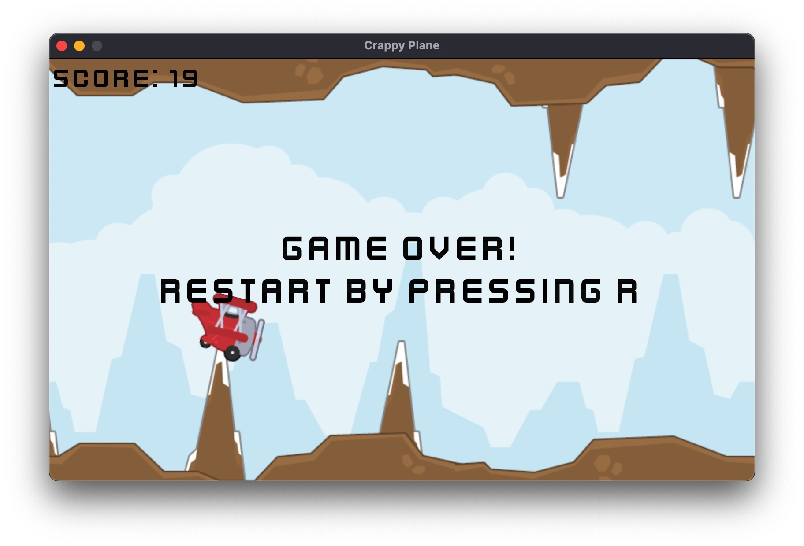

# Crappy plane



Example project I created to try out the [Rust](https://www.rust-lang.org/) game engine [Bevy](https://bevyengine.org/) and its ECS architecture.

Assets by the amazing [Kenney](https://kenney.nl/) (Tappy Plane pack, Font pack)

## Building for the web

Compilation to wasm inspired by

https://github.com/topheman/bevy-rust-wasm-experiments/tree/master

Setup

```
rustup target install wasm32-unknown-unknown
cargo install wasm-bindgen-cli
cargo install wasm-opt # not necessary, only for optimizing file size
```

Build

```
cargo build --target wasm32-unknown-unknown --release
wasm-bindgen --out-dir ./target/wasm32-unknown-unknown/out --target web ./target/wasm32-unknown-unknown/release/crappy_plane.wasm
wasm-opt -Os -o target/wasm32-unknown-unknown/out/crappy_plane_bg.wasm target/wasm32-unknown-unknown/out/crappy_plane_bg.wasm
```

I also created an index.html:

```
<!DOCTYPE html>
<html>
<head>
    <meta charset='utf-8'>
    <title>Crappy Plane</title>
</head>
<body style="margin: 0;">
    <script type="module">
        import init from './crappy_plane.js'
        addEventListener('load', () => {
            console.log('start');
            init();
        });
    </script>
</body>
</html>
```

I tested the output by serving files with

```
python3 -m http.server
```

And when it looked OK I zipped together all files and uploaded them to Itch.io